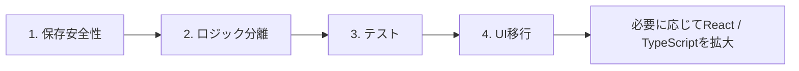

# 段階的移行ロードマップ

最終確認日: 2026-07-09  
対象: RunOS / wanoku-navi

この文書は、現在の単一HTMLアプリを安全に保守し、将来React/TypeScriptへ移行できる状態を作るためのロードマップです。現時点で全面移行を開始する提案ではありません。

## 1. 前提

### 確認済みの事実

- 両アプリともCSS、HTML、状態、計算、保存、描画を単一HTMLに内包しています。
- 自動テスト、型検査、ビルドシステムはありません。
- 両アプリともユーザーデータをブラウザ内へ保存します。
- RunOSは大きな活動データを単一localStorageキーへ保存します。
- wanoku-naviは複数キーへ保存しますが、保存失敗時にメモリへフォールバックします。
- 両アプリともiPhone Safariでの利用を意識したUIを持ちます。

### 評価・推測

- UIフレームワークだけ先に入れ替えると、保存事故や計算結果の変化を検出できません。
- 単一HTMLを一括分割すると、暗黙のグローバル依存と初期化順が崩れ、原因特定が難しくなります。
- 現行版を残した並行移行の方が、機能単位の比較とロールバックを行いやすいと考えられます。

## 2. 優先順位

優先順位は固定します。

1. **保存安全性**
2. **ロジック分離**
3. **テスト**
4. **UI移行**

ReactやTypeScriptの導入を、保存安全性より先に進めません。



## 3. 移行の原則

- 1差分1目的を基本とする。
- 既存HTMLを比較対象として残す。
- 保存形式と計算結果を同時に変えない。
- UI移行とドメインロジック修正を同時に行わない。
- 新旧経路を切り替えられる期間を設ける。
- 旧データは新形式の保存成功が確認できるまで削除しない。
- 各段階に明示的なロールバック方法を持たせる。
- iPhone Safariの確認を完了条件に含める。
- 推測した仕様を新仕様として固定しない。

## 4. 非目標

現段階では、以下を行いません。

- 両アプリの同時全面React化
- 単一HTMLの一括削除
- UIデザインの全面刷新
- 計算式の大規模な再設計
- 保存データの一括破棄
- APIプロバイダーの一括置換
- RunOSとwanoku-naviのドメインモデル統合

共通化する場合も、保存インターフェース、エラー表現、外部通信、UI部品などのインフラに限定し、ランニングと釣りのドメインロジックは分離します。

## 5. フェーズ1: 保存安全性

### 目的

コード整理より先に、利用者データを失わず、保存失敗を検出できる状態を作ります。

### RunOS

- `meridian.v1` の現行スキーマを一覧化する。
- 小・中・大データのJSONバックアップ例を用意する。
- 保存前のJSONサイズと保存結果を確認できるようにする。
- 保存失敗をユーザーと開発者の両方が確認できる形にする。
- 読込時のバージョン判定と入力検証方針を定義する。
- デモデータフォールバック前に、元データを破壊しない復旧経路を設ける。

### wanoku-navi

- Storeのキー、データ形状、更新タイミングを一覧化する。
- `localStorage` 失敗後のメモリフォールバックを明示する。
- バックアップの重複判定とマージルールを統一する。
- 複数キーが部分更新された状態を検出できる世代管理を検討する。
- 設定バックアップからAPIキーを除外または明示選択にする方針を定義する。

### IndexedDBについて

IndexedDBは候補ですが、このフェーズで即時全面移行しません。

先に次の抽象境界を定義します。

```text
load()
save()
export()
import()
health()
migrate()
```

その後、旧localStorageを読む実装とIndexedDB実装を並行させます。移行成功の確認前に旧キーを削除しません。

### 完了条件

- 現行保存形式が文書化されている。
- 保存失敗を検出できる。
- バックアップと復元の確認手順がある。
- 旧データを残したまま将来の保存層を差し替えられる。
- ロールバック時に旧版が同じデータを読める。

## 6. フェーズ2: ロジック分離

### 目的

画面を変えずに、状態、計算、通信、描画の境界を明示します。

### 方針

最初から全関数を移動しません。依存が小さく、入力と出力を定義しやすい箇所から始めます。

### RunOSの候補

1. 日付、丸め、ペース等のユーティリティ
2. TRIMP、PMC、ACWR、単調性
3. VO2、VDOT、Critical Speed / Power
4. 活動正規化
5. FIT解析とストリーム分析
6. 計画、回復、故障リスク

目標は、計算関数がグローバル `DB` を直接読まず、必要な値を引数で受け取ることです。

### wanoku-naviの候補

1. 日付、角度、距離等のユーティリティ
2. `angleDiff` の単一定義化
3. 潮汐、月齢、日出没
4. スポットと移動時間
5. スコアと根拠
6. ランキングと時間窓
7. JMA、Anthropic、Relay、地図のプロバイダー

目標は、計算関数がグローバル `S` を直接読まず、明示したコンテキストを受け取ることです。

### 移行中の形

```text
旧render関数
  ↓
薄い互換アダプター
  ↓
分離した計算関数
  ↓
現行と同じ結果
```

この段階では、現行DOMと画面構成を維持します。

### 完了条件

- 対象ロジックの入力と出力が定義されている。
- グローバル状態への読書きがアダプター境界へ限定されている。
- UIを呼ばずに計算関数を実行できる。
- 現行HTMLへ戻せる小さな差分になっている。

## 7. フェーズ3: テスト

### 目的

分離した境界で現行挙動を固定し、その後の変更を検出可能にします。

### 最初に作るテスト

#### RunOS

- TRIMP
- CTL / ATL / TSB
- ACWR、単調性、ストレイン
- eVO2max、VDOT、レース予測
- Critical Speed / Power
- 週間計画、手動オーバーライド
- FIT取込の正常、欠損、重複、非ランニング
- JSON保存形式の読込互換

#### wanoku-navi

- `angleDiff`
- 潮位、潮流、月齢、潮種
- 季節、水温、地形の部分スコア
- スポット別潮位補正
- 総合スコアと根拠
- ランキング、時間窓、移動時間
- 予測保存と検証
- Storeの読込、保存失敗、バックアップマージ
- JMA、Anthropic、Relayの固定JSONに対する正規化

### テストの種類

- キャラクタリゼーションテスト: 現行結果を固定する
- 単体テスト: 純粋関数の境界値を確認する
- 契約テスト: 外部APIとWorkerのJSON形式を確認する
- 保存互換テスト: 旧データを新実装で読めることを確認する
- ブラウザスモークテスト: 主要タブと基本操作を確認する
- 実機チェック: iPhone Safari特有の表示、入力、保存を確認する

### 完了条件

- 主要指標とスコアに固定入力・期待出力がある。
- 保存形式の後方互換を自動確認できる。
- 外部通信を実通信なしで再現できる。
- UI移行前後の結果差を検出できる。

## 8. フェーズ4: UI移行

### 目的

保存と計算が安定した後、画面単位でReactへ置き換えられるようにします。

### 方針

- Reactルートを一度にアプリ全体へ置かない。
- 読取中心で副作用が少ない画面から始める。
- 現行DOM版と新UI版を比較できるようにする。
- ルーター、状態管理ライブラリ、UIライブラリを最初から増やしすぎない。
- TypeScript型は保存スキーマとドメイン入力から定義する。

### 推奨順

#### RunOS

1. Libraryまたは読取専用カード
2. Fitnessの単独グラフ
3. Log一覧
4. Today
5. Coach
6. Season
7. Settingsとインポート

Settingsとインポートは保存事故の影響が大きいため、後半へ回します。

#### wanoku-navi

1. Season
2. 読取専用の条件・潮汐カード
3. Spots一覧
4. Logs
5. Forecast
6. Cockpitとルート
7. Settingsと外部接続

Forecast、Cockpit、Settingsは依存と副作用が大きいため、後半へ回します。

### 完了条件

- 旧UIと新UIで同じドメイン結果を表示する。
- 保存形式に意図しない変更がない。
- iPhone Safariで主要操作を完了できる。
- 新UIに問題があれば旧UIへ戻せる。

## 9. Web Workerと性能

Web Worker化は、ロジック分離とテストの後に検討します。

候補:

- RunOSのFITバイナリ解析
- RunOSのストリーム・平均最大曲線計算
- wanoku-naviの複数スポット×複数時間ランキング
- wanoku-naviの14日スキャン

Worker化前後で、同じ入力が同じ結果になることをテストします。Worker化と計算式変更を同時に行いません。

## 10. 外部通信の整理

将来は次のようなプロバイダー境界を作ります。

```text
RunOS:
- WeatherProvider
- GeolocationProvider
- FitImportProvider
- StravaImportProvider

wanoku-navi:
- WeatherProvider
- JmaProvider
- AiProvider
- RelayIntelProvider
- MapTileProvider
```

wanoku-naviのAPIキーは、将来的に管理されたWorker側へ集約します。Worker本体の所在と現行契約が確定するまでは、推測による本番実装を追加しません。

## 11. iPhone Safariの確認ゲート

各フェーズで、少なくとも以下を確認します。

- 通常Safariタブとホーム画面起動
- safe areaと固定下部UI
- アドレスバー伸縮時のレイアウト
- キーボード表示中の入力とボトムシート
- 位置情報の許可、拒否、タイムアウト
- JSON、CSV、FITのファイル選択
- Blobバックアップ保存
- オフライン、低速、通信失敗
- localStorageまたはIndexedDBの永続化
- 大量データ時の操作停止とメモリ使用

実機未確認の場合は、完了報告へ明記します。

## 12. ロールバック方針

- 旧保存形式を残す。
- 保存形式変更にはバージョンを付ける。
- 変換前バックアップを作る。
- 新形式への移行完了フラグを、データ本体と別に管理する。
- 旧HTMLをすぐ削除しない。
- 機能フラグまたは明確な差分単位で旧経路へ戻せるようにする。
- 一度の変更で保存、計算、UIの3層を同時に切り替えない。

## 13. 次の小さな作業候補

優先順位に沿い、次の5件を候補とします。

1. **保存スキーマ一覧を作る**
   - RunOSの `meridian.v1` とwanoku-naviの全Storeキーを、フィールド、型、必須・任意、生成元付きで文書化する。
   - アプリコードは変更しない。

2. **バックアップ・復元の手動確認表を作る**
   - 空データ、通常データ、大容量データ、破損JSON、旧版JSONについて、期待動作とデータ消失防止手順を定義する。
   - まず保存安全性の基準を決める。

3. **RunOS指標のゴールデン入力を作る**
   - 心拍あり・なしの活動と30〜60日分の小さな履歴をJSON fixtureとして定義し、TRIMP、CTL、ATL、TSB、eVO2maxの現行出力を記録する。
   - 計算式はまだ変更しない。

4. **wanoku-naviの `angleDiff` と潮汐の固定例を作る**
   - 二重定義を削除する前に、角度境界、代表日時、代表スポットの現行結果を記録する。
   - その後、単一定義化だけを独立した小さな変更として行えるようにする。

5. **Worker API契約を文書化する**
   - `/intel` と `/v1/messages` の要求、成功応答、部分失敗、エラー、CORS、認証の例を、現在のクライアント実装から整理する。
   - Worker本体の所在確認までは、新しい本番Workerを推測で実装しない。

この5件を終えるまでは、全面React化を開始しないことを推奨します。
