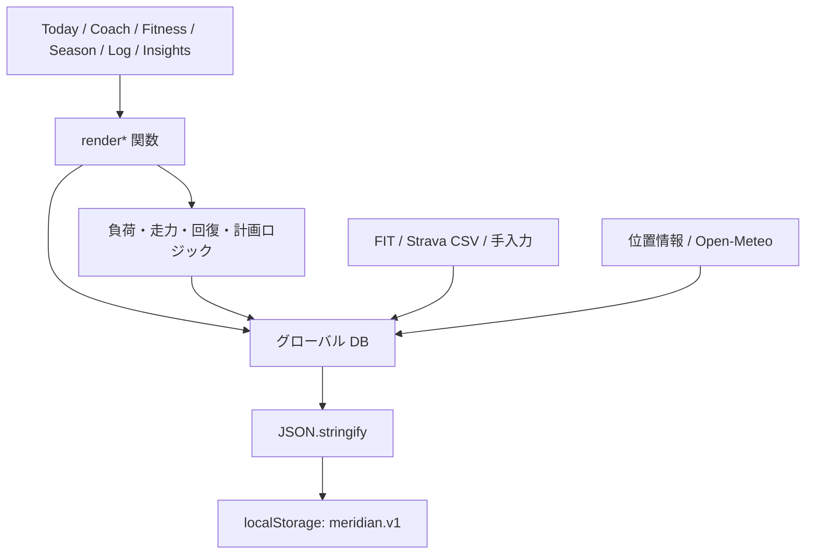

# RunOS 現状設計メモ

最終確認日: 2026-07-09  
対象: `runos/RunOS v100 apex.html`

この文書は、RunOSの現行実装を安全に保守するための静的解析メモです。作業規約はリポジトリ直下の `AGENTS.md` を優先してください。

## 1. この文書の読み方

以下を明確に分けます。

- **確認済みの事実**: 現在のソースコードから直接確認できる内容
- **評価・推測**: 事実から予想される障害、性能問題、保守上のリスク

実ブラウザ、実FITデータ、iPhone実機を使った動作確認は、この調査には含まれていません。

## 2. アプリの目的

### 確認済みの事実

RunOSは、ランニング活動、体調、プロフィール、レース結果、シューズ、環境情報を統合して、トレーニング判断を支援するローカルファーストWebアプリです。

主な機能領域:

- Today: レディネス、ウェルネス、今日の練習判断
- Coach: 個人向けの分析、練習方針、ペース・心拍ゾーン
- Fitness: CTL、ATL、TSB、VO2、負荷・効率の推移
- Season: 目標レース、期分け、週間計画、遵守状況
- Log: 活動記録、FIT取込、手入力、活動詳細
- Insights: リミッター、耐久性、フォーム、トレーニング負荷分析
- Library: トレーニング科学の解説
- Settings: プロフィール、シューズ、環境、バックアップ、CSV・JSON取込

## 3. 現在の物理構成

### 確認済みの事実

- アプリ本体は約463KB、約6,357行の単一HTMLです。
- CSS、HTMLシェル、状態、計算、インポート、SVG生成、描画、イベント登録が同じファイルにあります。
- 静的な正規表現集計では、名前付き関数が254個あります。
- ビルド処理、モジュール境界、型検査、自動テストはありません。
- URLハッシュを使った独自ルーターで画面を切り替えます。
- 画面の多くはテンプレート文字列を `innerHTML` に設定してからイベントを登録します。



### 評価・推測

単一ファイルであること自体よりも、状態、計算、描画が同じグローバルスコープで相互参照することが主な保守リスクです。ある指標の変更が、どの画面へ波及するかを機械的に判定できません。

## 4. 状態と保存

### 確認済みの事実

- 中心状態はグローバル変数 `DB` です。
- `profile`、`activities`、`wellness`、`plan`、`planOverrides`、`adjustLog`、`shoes`、`env`、`races` などを保持します。
- 全状態を `JSON.stringify(DB)` し、`localStorage` の単一キー `meridian.v1` に保存します。
- 保存時の例外は空の `catch` で無視されます。
- 読込またはJSON解析に失敗すると、デモデータ生成へフォールバックします。
- JSONバックアップの読込は、読み込んだ値をスキーマ検証せず `DB` へ代入します。
- FIT活動には、ダウンサンプルされたストリーム、GPS、ラップ、平均最大曲線なども保存されます。

### localStorage単一保存のリスク

#### 確認済みの事実

- 小さな設定値と大きな活動ストリームが同じキーに格納されます。
- 1件の更新でもDB全体を再シリアライズして同期的に書き込みます。
- 保存失敗を利用者へ通知する仕組みがありません。

#### 評価・推測

- FIT取込件数が増えると、ブラウザの保存上限へ達する可能性があります。
- `JSON.stringify` と同期書込が、活動数の増加に伴って操作停止やフレーム落ちを起こす可能性があります。
- 保存上限へ達した場合、画面上のメモリ状態だけ更新され、再読込後に変更が消える可能性があります。
- 単一キーが破損すると、設定だけ、活動だけ、といった部分復旧が困難です。
- 読込失敗後にデモデータを保存する経路が動くと、復旧可能だった元データへ上書きする危険があります。

### 将来の保存改善に必要な準備

1. 現在の `DB` 形状を文書化する。
2. 実データを匿名化した小・中・大サイズのバックアップ例を用意する。
3. 保存前後のバイト数、成功、失敗理由を確認できるようにする。
4. JSON読込へバージョン判定とスキーマ検証を追加する。
5. 保存処理をUIから隠蔽するリポジトリ層を定義する。
6. IndexedDBへ移す場合も、旧 `meridian.v1` を読める段階移行にする。
7. 移行成功が確認できるまで旧キーを削除しない。

## 5. FIT解析パイプライン

### 確認済みの事実

FIT取込は、おおむね次の流れです。

1. `File.arrayBuffer()` でファイルを読む。
2. `parseFit()` がFITメッセージ定義とレコードを解析する。
3. `dispatch()` がセッション、ラップ、レコード等へ振り分ける。
4. `finalize()` が距離、速度、心拍、標高、GAP等を組み立てる。
5. 平均最大速度・パワー、デカップリング、xPower、VI、GPS、ベスト努力等を計算する。
6. `normalizeActivity` 相当の活動データとして `DB.activities` へ追加する。
7. 活動種別推定とインターバル検出を行い、DB全体を保存する。

### FIT解析の重さ

#### 確認済みの事実

- バイナリ解析、標高平滑化、GAP、1秒相当の再サンプル、移動窓、ベスト努力探索をブラウザのメインスレッドで実行します。
- 複数FITファイルを順番に処理します。
- 解析後にDB全体を同期保存します。

#### 評価・推測

- 長時間活動、細かい記録間隔、複数ファイルの一括取込では、iPhone SafariでUIが長く停止する可能性があります。
- メモリが小さい端末では、元バッファ、解析途中の配列、保存用JSONが同時に存在し、メモリ圧迫が起きる可能性があります。
- 解析途中の失敗がファイル単位では表示されても、計算途中のどの段階かは診断しにくい状態です。

### 将来の分離候補

- `fit/parser`: バイナリ構造の解釈
- `fit/normalizer`: FIT値から標準活動形式への変換
- `activity/stream-analysis`: GAP、デカップリング、平均最大曲線
- `activity/deduplication`: 重複ID判定
- `workers/fit-import`: Web Workerとの境界

Web Worker化は有力候補ですが、解析結果の互換テストを作る前に移動しないでください。

## 6. 計算ロジック

### 確認済みの事実

主な計算領域:

- TRIMPと日別負荷
- PMC、CTL、ATL、TSB
- ACWR、単調性、ストレイン
- eVO2max、VDOT、レース予測
- Critical Speed / Critical Power
- 閾値、ペースゾーン、心拍ゾーン
- ランニングエコノミー、耐久性、フォーム
- トレーニング効果、回復時間、故障リスク
- 週間計画、シーズンプラン、遵守率、将来PMC
- シューズ、気温、湿度、標高、補給、W′

多くの関数は数値計算中心ですが、引数だけでは完結せずグローバル `DB` を直接読むものがあります。

### 計算ロジックと描画の密結合

#### 確認済みの事実

- `renderToday`、`renderCoach`、`renderFitness` 等が計算関数を直接呼びます。
- 描画処理内に条件分岐、判定文、閾値、説明生成が含まれます。
- 描画後に同じ関数内または関連する `wire*` 関数でイベントを付けます。
- 一部の計算失敗は空の `catch` により、そのカードだけ表示されない形で隠れます。

#### 評価・推測

- UI文言の修正でも、計算条件へ触れてしまう可能性があります。
- 同じ指標が複数画面で別の呼び方やタイミングで再計算され、将来不整合が生じる可能性があります。
- カードが消えた場合に、データ不足なのか例外なのか区別しにくいです。

### 分離時の目標形

```text
入力データ
  ↓
型付きドメイン関数
  ↓
画面用ViewModel
  ↓
DOMまたはReactコンポーネント
```

計算関数は、可能な限り `DB` 全体ではなく必要な値だけを引数で受け取り、副作用なしで結果を返す形を目指します。

## 7. 指標計算をテスト化する必要性

### 確認済みの事実

- 現在、自動テストはありません。
- 同じ活動データが、Today、Coach、Fitness、Season、Insightsの多数の判断へ使われます。
- 閾値やプロフィール値の変更が、複数指標へ連鎖します。

### 評価・推測

ReactやTypeScriptへコードを移すだけでも、日付、丸め、欠損値、配列順序、グローバル状態の初期化順により結果が変わる可能性があります。UI移行前に、少なくとも次の固定入力・期待出力が必要です。

- 心拍あり・なしのTRIMP
- 休養日を含むCTL/ATL/TSB
- 活動0件、1件、十分な履歴がある場合
- eVO2maxとレース予測
- Critical Speed / Power
- ACWR、単調性、ストレイン
- 週間計画と手動オーバーライド
- FITの最小ファイル、通常ファイル、欠損フィールド、非ランニング
- タイムゾーン境界と日付切替
- NaN、0除算、空配列への耐性

テストは「理想値へ修正する」ためではなく、まず現行結果を固定するキャラクタリゼーションテストとして作ります。

## 8. 外部通信とiPhone Safari

### 確認済みの事実

- 現在地取得にGeolocation APIを使います。
- 天候取得にOpen-Meteoを使います。
- JSON・CSVバックアップはBlob URLとプログラムによるリンククリックを使います。
- モバイル向けにsafe area、下部タブ、横スクロール対応があります。
- サイドレールに `100vh` が使われています。

### 評価・推測

- `file://`、通常Safari、ホーム画面アプリでは、位置情報、保存、ダウンロードの挙動が異なる可能性があります。
- 固定下部タブ、ドロワー、入力欄はソフトウェアキーボードと競合する可能性があります。
- 大量FIT解析と同期保存は、デスクトップよりiPhoneで問題が顕在化しやすいと考えられます。

## 9. 変更前チェック

- 対象関数が `DB` のどのフィールドを読むか
- 同じ指標を使う全画面
- 保存形式とバックアップ形式への影響
- デモ生成、全消去、JSON読込への影響
- FIT、Strava CSV、手入力の共通データ形状
- iPhone Safariで重い同期処理が増えないか
- 例外が利用者へ見えるか、または診断可能か

## 10. 当面の方針

全面React化はまだ行いません。優先順位は以下です。

1. 保存安全性
2. ロジック分離
3. テスト
4. UI移行

詳細は `docs/migration-roadmap.md` を参照してください。
