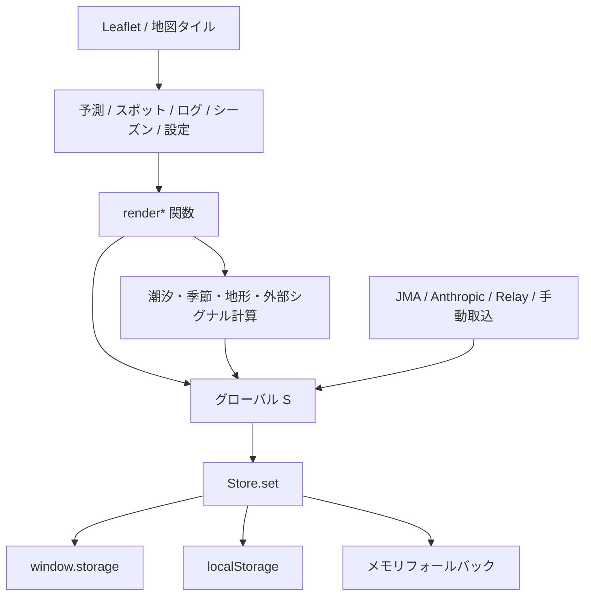

# wanoku-navi 現状設計メモ

最終確認日: 2026-07-09  
対象: `wanoku-navi/wanoku navi v27 yakou.html`

この文書は、wanoku-naviの現行実装を安全に保守するための静的解析メモです。作業規約はリポジトリ直下の `AGENTS.md` を優先してください。

## 1. この文書の読み方

以下を明確に分けます。

- **確認済みの事実**: 現在のソースコードまたはリポジトリ構成から直接確認できる内容
- **評価・推測**: 事実から予想される障害、性能問題、保守上のリスク

実際のCloudflare Worker、外部API、iPhone実機を使った動作確認は、この調査には含まれていません。

## 2. アプリの目的

### 確認済みの事実

wanoku-naviは、東京湾奥を中心とした釣行判断支援アプリです。魚種、日時、潮汐、季節、水温、天候、地形、ベイト、釣果、移動時間を組み合わせて候補スポットと釣行計画を提示します。

主な機能領域:

- Executive Cockpitによる当日の判断
- 魚種別スコア、根拠、信頼度
- 短時間釣行、ランガン順序、撤退判断
- ピンスポット、広域傾向、狙い目時間
- 7日予測、14日候補、シーズン・ベイト情報
- スポットDB、Leaflet地図、移動時間
- 実釣ログ、外部釣果、公式情報、予測検証
- 非釣行期間の情報収集
- 重み調整、ソース信頼度学習、環境反映ゲイン
- JMA、Anthropic API、Cloudflare Worker、RSS等の外部情報

## 3. 現在の物理構成

### 確認済みの事実

- アプリ本体は約513KB、約5,846行の単一HTMLです。
- CSS、HTML、データベース相当の定数、状態、潮汐計算、スコア計算、描画、イベント、通信が同じファイルにあります。
- 静的な正規表現集計では、名前付き関数が324個あります。
- `innerHTML` への代入・参照は81箇所あります。
- `document.addEventListener` は6箇所、`window.addEventListener` は3箇所あります。
- `setInterval` は3箇所あります。
- ビルド処理、モジュール境界、型検査、自動テストはありません。

### 評価・推測

画面、スコア、通信、保存がグローバル状態を介してつながっているため、局所的な修正でも予測結果、検証履歴、学習値へ影響し得ます。コード量より、暗黙の依存関係が主なリスクです。

## 4. グローバル状態と関数

### 確認済みの事実

- 中心状態はグローバル変数 `S` です。
- `spots`、`logs`、`signals`、`settings`、`ai`、`forecasts`、`tuningHistory`、`observations`、`fieldDecisions`、`reviewReports`、`tripPlans`、`officialSignals`、`noFishingNotes` 等を保持します。
- 多数の関数が `S` を直接読み書きします。
- スコアと潮汐には `_SC`、`_TH` というグローバルキャッシュがあります。
- 画面切替時や条件変更時にキャッシュを明示的に消去します。

### グローバル関数の多さ

#### 確認済みの事実

- 名前付き関数は静的集計で324個あります。
- 関数は単一のグローバルスコープに置かれています。
- 描画、状態更新、計算、文字列生成、通信などの命名規則と境界は一部ありますが、モジュールとして強制されていません。

#### 評価・推測

- 新しい関数名が既存定義と衝突しても、ビルド時に検出されません。
- 関数が必要とする状態をシグネチャだけから判断できません。
- 定義順、初期化順、後勝ちの関数宣言に依存する可能性があります。

## 5. `angleDiff` 二重定義

### 確認済みの事実

同じグローバルスコープに、`angleDiff` が2回定義されています。

- 1つ目: 風向とスポット方角の適合計算付近
- 2つ目: 後半の異常・判断ロジック付近

現在の2実装は、どちらも角度差を0〜180度へ正規化する、実質的に同等の計算です。JavaScriptの同名関数宣言では後の定義が有効になります。

### 評価・推測

- 現時点では結果差が見えにくくても、一方だけ修正すると、編集箇所と実際に使われる実装が一致しない事故が起きます。
- 片方を即座に削除する前に、代表角度の期待値を固定し、全呼出元を確認する必要があります。

### 安全な解消手順

1. `0/0`、`0/180`、`350/10`、負値、360超の入力を固定する。
2. 両実装が同じ結果になることを確認する。
3. 呼出元を検索する。
4. 共通関数を1箇所へ寄せる小さな差分を作る。
5. 風向スコア、広域判断、Cockpitの結果を比較する。

## 6. 描画とイベント

### innerHTML再描画とイベント再付与

#### 確認済みの事実

- 多くの画面が `innerHTML` でまとまったDOMを置き換えます。
- 置換後に `onclick`、`onchange`、`oninput` を再設定する処理があります。
- 画面全体のイベント委譲として、複数の `document.addEventListener('click', ...)` も使われています。
- `renderForecast()` は即時描画後、`setTimeout` でランキング、Cockpit、ルート等を遅延描画します。
- 一部の描画は `safeCall` や空の `catch` によって失敗を局所化します。

#### 評価・推測

- DOM置換後のイベント再付与を忘れると、見た目は正常でも操作だけ不能になります。
- 個別ハンドラとイベント委譲の両方が同じ操作を拾うと、二重処理の可能性があります。
- 遅延描画中に日付や魚種が変わると、古い条件の結果が新しい画面へ描かれる競合が起こる可能性があります。
- 例外が隠されることで、空表示が「データなし」に見える可能性があります。
- 外部入力をテンプレート文字列へ挿入する箇所では、エスケープ漏れが安全性問題につながります。

### 当面の変更ルール

- 再描画対象のDOMと、再登録が必要なイベントをセットで確認する。
- 既存のイベント委譲で扱える操作に、追加の個別リスナーを重ねない。
- 外部データは `esc()` または `textContent` を使う。
- 非同期処理には、開始時の魚種、日付、画面IDを保持し、完了時に現在値と一致するか確認する。

## 7. 保存

### 確認済みの事実

- `Store` は `window.storage`、`localStorage`、メモリの3モードを持ちます。
- 通常ブラウザでは、利用可能なら `localStorage` を使います。
- 読込失敗時は対象値を `null` として扱います。
- 書込失敗時はメモリへ保存します。
- 設定、スポット、ログ、シグナル、予測等は複数キーに分けて保存されます。
- JSONバックアップ読込は、多くの配列を既存状態へマージします。

### 評価・推測

- 書込失敗後にメモリへフォールバックしても、利用者には永続化失敗が明示されないため、再起動後にデータが消えたように見える可能性があります。
- バックアップの配列ごとに重複判定方法が異なり、一部は重複追加される可能性があります。
- 複数キー更新の途中で失敗すると、設定だけ新しくログは古い、といった部分更新が起こり得ます。
- `window.storage` は一般的なWeb標準APIではないため、その存在を通常ブラウザ向けの前提にできません。

### 将来の保存改善に必要な準備

1. 各保存キーとデータ形状を一覧化する。
2. バックアップ形式のバージョンと必須項目を定義する。
3. 書込結果と永続モードを利用者が確認できるようにする。
4. 複数キー更新にコミット相当の世代番号を持たせる案を検討する。
5. IndexedDB化する場合も既存キーの読込を残し、成功確認前に削除しない。

## 8. スコアエンジン

### 確認済みの事実

スコアは少なくとも次を組み合わせます。

- 魚種ごとの季節性
- ベイトと地形の適合
- 地形、構造物、待ち伏せ、流れ
- 水温と適水温
- 潮汐、流速、満干、スポット別潮位補正
- 日出没、マズメ、夜間、月齢
- 風向、風速、雨
- 直近釣果、ユーザーログ、外部シグナル
- 移動時間
- 外部環境情報とソース信頼度

結果はランキングだけでなく、Cockpit、短時間釣行、ルート、ゴールデンウィンドウ、予測保存、後日の検証へ使われます。

### 評価・推測

- 重みや補正の小変更でも、表示順位だけでなく保存される予測履歴と学習結果が変わります。
- キャッシュキーへ含まれない入力が増えると、変更前の計算結果が再利用される可能性があります。
- 現在のフィールド知識、固定定数、オンライン情報、利用者ログの境界が曖昧な箇所があります。

### 将来の分離候補

- `domain/tide`: 潮位、潮流、月齢、日出没
- `domain/species`: 季節、適水温、生態定数
- `domain/spot`: 地形、潮位補正、移動
- `domain/scoring`: スコアと理由
- `domain/ranking`: 時間窓と候補順位
- `domain/validation`: 予測保存と検証
- `providers/jma`
- `providers/anthropic`
- `providers/relay`
- `providers/map`

## 9. APIキーと外部通信

### 確認済みの事実

- 接続モードに `sandbox`、`apikey`、`proxy` があります。
- `apikey` モードではAnthropic APIキーをブラウザ側設定に保持し、ブラウザからAnthropic APIへ直接送信します。
- `proxy` モードでは設定URLの `/v1/messages` または `/intel` を呼びます。
- JMAの予報・警報JSONを直接取得します。
- Google Fonts、Leaflet、地理院、OpenStreetMapの外部リソースを利用します。

### APIキーをブラウザ側に置くリスク

#### 確認済みの事実

- APIキーはアプリの設定状態としてブラウザ保存領域へ入ります。
- 同一オリジン上で動くJavaScriptは、その保存値へアクセスできます。
- バックアップへ設定全体を含める経路があります。

#### 評価・推測

- XSS、共有端末、バックアップ共有、ブラウザ拡張等を通じてキーが露出する可能性があります。
- 利用量制限をクライアント側だけで強制できません。
- 配布HTMLに直接モードを残すと、利用者が意図せず高額なAPI呼出を行う可能性があります。

### 推奨方向

- 新規機能ではブラウザ直接キー方式を拡張しない。
- 将来的には、キーを保持する管理されたWorkerへ通信を集約する。
- Worker側で許可オリジン、レート、入力長、接続先、ログの秘匿を制御する。
- クライアントには秘密情報を返さない。

## 10. Worker本体の欠落

### 確認済みの事実

- `SETUP 自動取得.md` は `wanoku-relay.worker.js` を参照します。
- そのWorkerファイルは現在のリポジトリに存在しません。
- セットアップ文書は旧HTML名 `wanoku_navi_v25_auto_intel.html` を参照します。
- 現在のアプリはv27です。

### 評価・推測

- 新しい環境でREADMEどおりに自動取得機能を再現できません。
- `/intel` の要求・応答形式が、アプリ実装だけを根拠にした暗黙仕様になっています。
- Workerが別管理されている場合、クライアントとWorkerのバージョン不一致を検出できません。

### 必要な整理

1. Workerが別リポジトリ、未追跡、消失のどれかを確認する。
2. `/`、`/intel`、`/v1/messages` の責務を文書化する。
3. リクエスト・レスポンス・エラーのJSON例を保存する。
4. CORS、認証、レート制限、ログ方針を明記する。
5. 現行v27向けにセットアップ文書を更新する。

Workerの所在が確定するまで、推測で新しいWorker実装を本番用として追加しないでください。

## 11. iPhone Safari

### 確認済みの事実

- `viewport-fit=cover`、safe area、固定下部タブ、ボトムシートがあります。
- Geolocation、ファイル選択、Blob URLダウンロードを使います。
- 地図とフォントは外部リソースへ依存します。
- manifestはdata URLですが、アイコンとService Workerはありません。
- メインスレッドで潮汐、複数時間・複数スポットのスコア計算、Canvas描画を行います。

### 評価・推測

- キーボード表示時にボトムシートや固定タブが入力欄と重なる可能性があります。
- `file://` ではCORS、位置情報、外部スクリプト、保存の挙動がHTTPS配信と異なる可能性があります。
- 多数スポット×時間窓×複数日の計算は、iPhoneで操作遅延を起こす可能性があります。
- ホーム画面アプリとしてのオフライン性は、現状では限定的です。

## 12. 変更前チェック

- `S` のどのフィールドを読む・書くか
- `_SC` または `_TH` の無効化が必要か
- スコア変更が予測履歴・検証・学習へ波及しないか
- `innerHTML` 後に必要なイベントを再登録しているか
- イベント委譲と個別ハンドラが重複しないか
- 外部入力をエスケープしているか
- 通信失敗時にオフライン表示へ戻れるか
- localStorage失敗を成功表示していないか
- iPhone Safariの固定UI、入力、ファイル操作に影響しないか

## 13. 当面の方針

全面React化はまだ行いません。優先順位は以下です。

1. 保存安全性
2. ロジック分離
3. テスト
4. UI移行

詳細は `docs/migration-roadmap.md` を参照してください。
